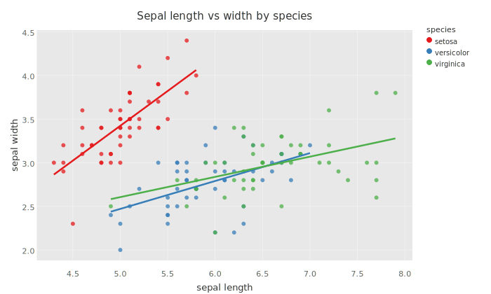
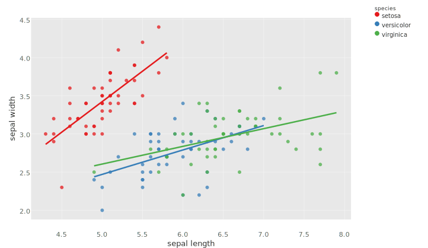
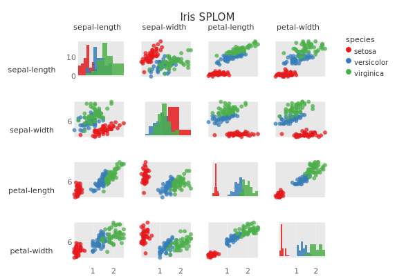

# Plotje
Composable plotting in Clojure



Plotje is a Clojure library for composable plotting, inspired by
the Grammar of Graphics.


## General info

|||
|-|-|
|Website | [https://scicloj.github.io/plotje/](https://scicloj.github.io/plotje/)
|Source |[](https://github.com/scicloj/plotje)|
|Deps |[](https://clojars.org/org.scicloj/plotje)|
|License |[MIT](https://github.com/scicloj/plotje/blob/main/LICENSE)|
|Status |🛠alpha🛠|


## Usage

While the first release `0.1.0` is being prepared, install Plotje
directly from GitHub by adding this to your `deps.edn`:

```clojure
io.github.scicloj/plotje
{:git/url "https://github.com/scicloj/plotje.git"
 :git/sha "<sha-from-main>"}
```

Once 0.1.0 is published to Clojars, the install line will become:

```clojure
org.scicloj/plotje {:mvn/version "0.1.0"}
```

Plotje is intended to be used with data-visualization tools
that support the [Kindly](https://scicloj.github.io/kindly) convention
such as [Clay](https://scicloj.github.io/clay/).


## Quick example

Line chart with point markers from plain Clojure data:
```clj
(-> [{:month "Jan" :sales 120}
     {:month "Feb" :sales 95}
     {:month "Mar" :sales 140}
     {:month "Apr" :sales 175}
     {:month "May" :sales 160}
     {:month "Jun" :sales 210}]
    (pj/lay-line :month :sales)
    pj/lay-point
    (pj/options {:title "Monthly Sales"}))
```


Scatter plot matrix (SPLOM) — all pairwise combinations with color grouping:
```clj
(-> (rdatasets/datasets-iris)
    (pj/pose {:color :species})
    (pj/pose (pj/cross [:sepal-length :sepal-width
                        :petal-length :petal-width]
                       [:sepal-length :sepal-width
                        :petal-length :petal-width]))
    (pj/options {:title "Iris SPLOM"}))
```



## Not yet supported

A few common plotting tasks are not yet covered: dual y-axes,
rolling-window statistics (compute the column externally before
plotting), and Q-Q or other diagnostic plots.


## Documentation

[Full documentation](https://scicloj.github.io/plotje/)


## License

Copyright © 2025-2026 Scicloj

Distributed under the MIT License.